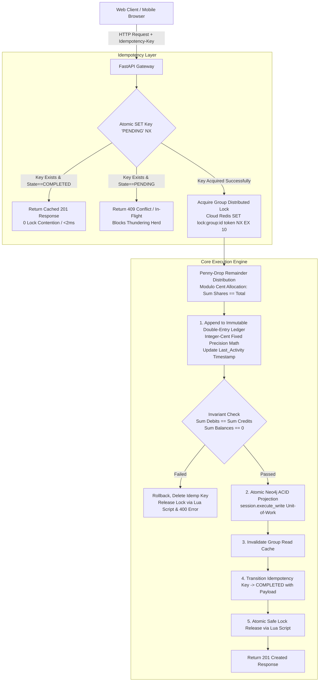

# FinGraph Architecture & Enhancement Plan: UX Product Polish + Distributed Backend Systems

## Overview
This plan seamlessly unifies the consumer-facing product requirements (No-Auth Local Wallet, interactive member drawer, payment deep links, graph routing fixes) with **enterprise-grade distributed backend infrastructure** (atomic 3-state idempotency, Penny-Drop remainder allocation, Lua-safe distributed locking, immutable double-entry ledger with integer cents, ACID Neo4j graph projections, read-through caching, and Locust load testing).

---

## 1. Architectural Strategy & Upgrades



---

### A. Immutable Double-Entry Ledger & Data Invariants (`ledger.py`)
* **Single Source of Truth:** Append-only transactional log (`TransactionEntry`). The Neo4j graph acts as a projected view.
* **Conservation-of-Money Invariant:** Every financial transaction must satisfy $\sum \text{Credits} - \sum \text{Debits} = 0$.

### B. Integer-Cent Arithmetic & "Penny-Drop" Allocation
* **Penny-Drop Distribution:** Splitting $\$10.00$ by 3 yields $333$ cents each with a $1$ cent remainder. The remainder is distributed $+1$ cent to the first $R$ participants so $\sum \text{shares} \equiv \text{total\_cents}$ exactly.

### C. Safe Distributed Locking (`lock_service.py`)
* **Cloud Redis Support:** Connects directly to Upstash/Render Redis containers via `REDIS_URI`.
* **Safe Atomic Release (Lua Script):** Validates ownership UUID before releasing the lock to prevent lock-stealing if operations exceed TTL.

### D. 3-State Idempotency State Machine (`idempotency.py`)
* **Thundering Herd Protection:** Atomic `PENDING` $\rightarrow$ `COMPLETED` state transitions block simultaneous identical retries with a `409 Conflict`.

### E. Neo4j ACID Transaction Blocks (`session.execute_write`)
* **Atomic Projections:** Wrap all projection queries inside `session.execute_write(tx_work_fn)` as a single ACID unit of work.

### F. Read-Through Caching & Write Invalidation (`cache_service.py`)
* **Read-Through Redis Cache:** Caches serialized network topologies. Write-invalidated immediately after ledger commits.

---

## 2. Privacy, Garbage Collection & Frontend UX

### A. Landing Page & Routing Separation
* **`/` (Landing Page):** A clean landing view offering two actions:
  1. **Create Trip:** Routes to `/create` with a full trip setup form.
  2. **Join Trip:** Input box for a trip code or URL (e.g. `123e4567`). Routes to `/trip/:id`.
* **`/trip/:id` (Dashboard):** The actual Graph Dashboard.

### B. Secret Link Privacy & Persona Memory
* **Data Isolation:** Removed public fetching of all groups. Users only see trips stored in their local browser wallet (`localStorage`).
* **Persona Storage:** When joining a trip, the user clicks "I am [Name]" on a popup. We save `localStorage.setItem('fingraph_persona', JSON.stringify({ trip_id: member_id }))`. Future visits instantly load their persona.
* **Limits:** Browsers provide 5MB of space. A trip ID is ~36 bytes, meaning a user can store over 130,000 trips locally.

### C. Automated Garbage Collection & Anti-Spam
* **Inactive Trip Cleanup:** A background `cron` script or scheduled endpoint that deletes trips (and their expenses) where `last_activity_at < NOW() - 30 days`. Keeps the database lightweight and cost-free.
* **Rate Limiting:** Protect the backend API (specifically `/groups` creation) with IP-based rate limiting using Redis, restricting creation to a sensible maximum (e.g., 5 trips per hour) to prevent malicious scraping or DB bloat.

### D. 1-Click Payment Deep Links
* **Payment Handles:** Member nodes support `payment_handles`:
  - **Venmo:** `venmo://paycharge?txn=pay&recipients={handle}&amount={amount}&note={note}`
  - **CashApp:** `https://cash.app/${cashtag}/${amount}`
  - **PayPal:** `https://paypal.me/{username}/{amount}`
  - **Zelle:** 1-click clipboard copy.

---

## 3. Verification Plan

### Automated Backend Tests
```bash
uv run pytest -v
```
- Validates penny-drop division, 3-state idempotency, ledger balance invariants, Neo4j transaction rollback safety, and debt simplification.

### Concurrency Stress Test
```bash
uv run pytest tests/test_concurrency.py -v
```

### UI & Privacy Verification
1. **Landing Page:** Verify the root URL shows the Create/Join options without exposing the global list of trips.
2. **Persona Memory:** Join a trip, select a persona, refresh the page, and verify the app remembers who you are.
3. **Graph Arrowheads:** Inspect directed debt arrows point accurately to target cards with zero edge clipping.
4. **Member Drawer:** Click on a graph node to verify payment deep link generation (Venmo/CashApp).
